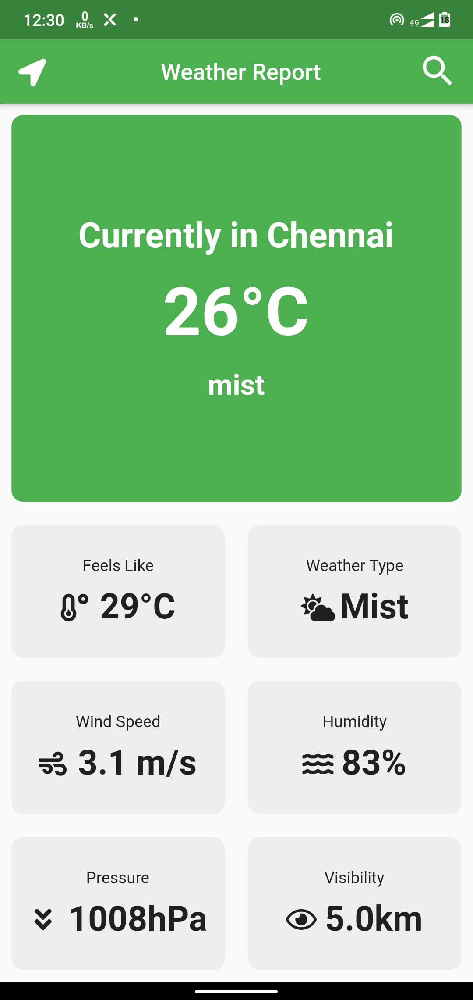

# Weather App

A new Flutter application to ckeck on the weather in your place or any city you are intrested in,

## Features:
1. Opens with a cool animation by [flutter_spinkit ](https://pub.dev/packages/flutter_spinkit).
2. Will automatically detect your location ass soon as you open the app, and transitions into the weather display page to show weather, temperature and other related stuffs.
3. Has a search button on the appbar that will transition you to the nextpage where you can search for the city you want to find the weather for.
4. Will not crash if you enter a wrong city name, but will jump back to your city search screen.
5. Has a navigation button on the app bar so that you can jump back to the weather of your location after looking up weather of other cities.

## ScreenShots: 

  

**API USED:** [OpenWeatherMap](https://openweathermap.org/)
